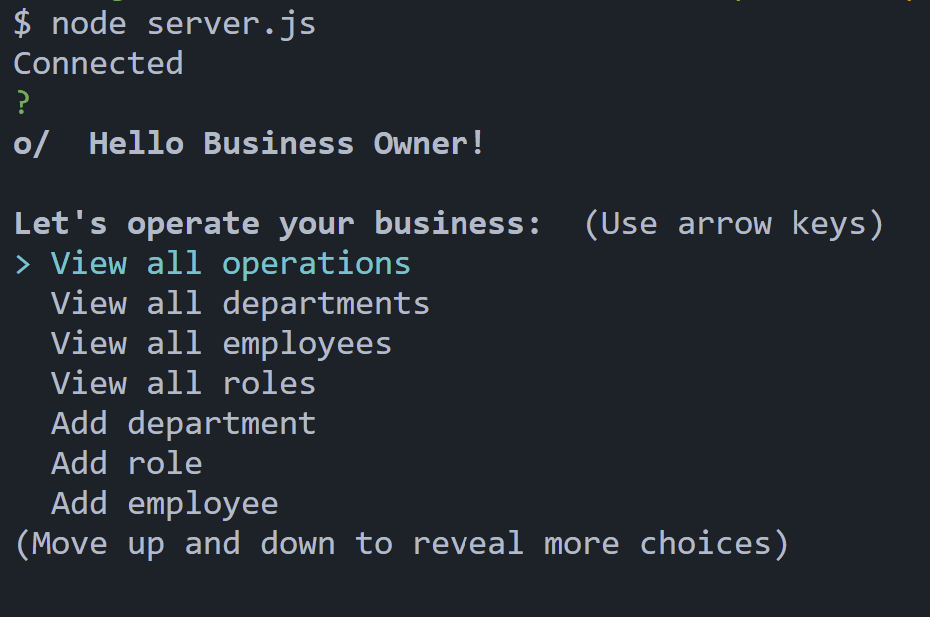

# SQL Employee Tracker App

Licensing: [mit](https://choosealicense.com/licenses/mit/)

## Table of Contents

- [Description](#description)
- [Installation](#installation-requirements)
- [Usage](#application-usage)
- [License](#licensing-information)
- [Contributions](#contributions)
- [Tests](#tests-commands)
- [Video Link](#link-to-video-instructions)
- [Screenshot](#screenshot)
- [Questions](#questions)

## Description

A command line application designed for business owners to view and manage their departments, roles, and employees.

## Installation Requirements

inquirer

- npm i inquirer@8.2.4

mysql2

- npm install --save mysql2

## Application Usage

Utilize command line prompts to view and manage a database containing departments, roles, and employee information.

## Contributions

Eric Keeton

## Test Commands

mysql -u root -p

source schema.sql;

source seeds.sql;

node server.js

## Link to Video Instructions

https://drive.google.com/file/d/1wsM_1urU9xrarY-6SzKSyDOEsneCzteA/view

## Screenshot

## Questions

For Questions, contact me at emk2473@gmail.com or visit My Github: [emk2473](https://github.com/emk2473)
